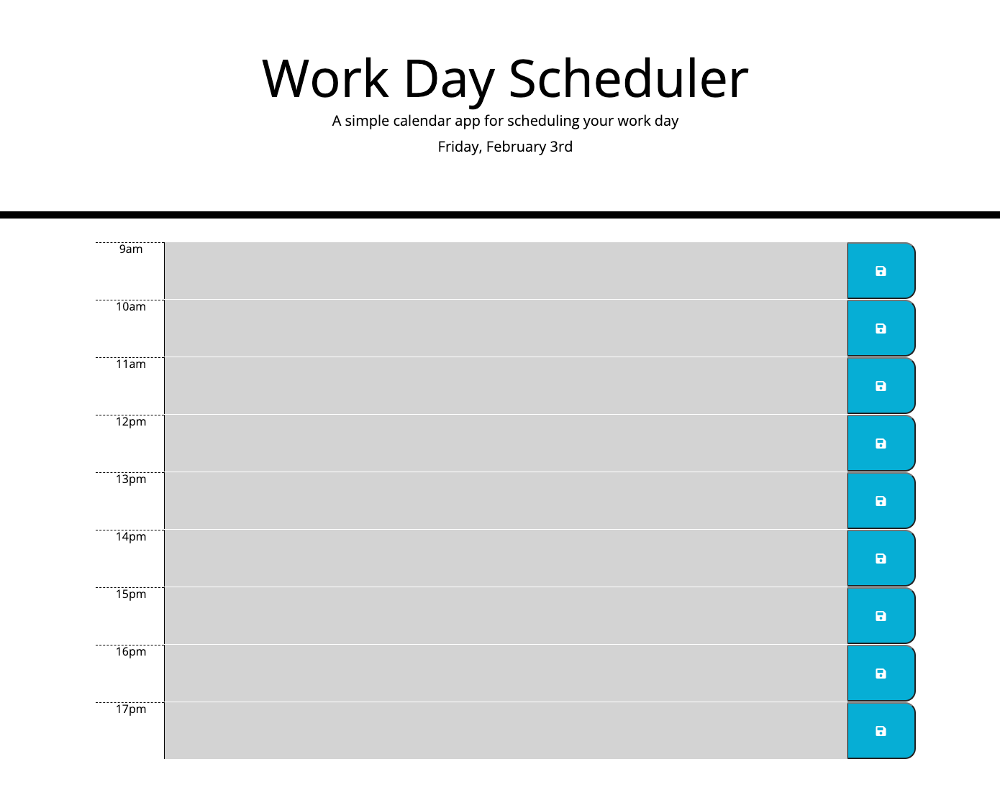

# Daily-Planner-App

## My Task

This project was created to help me practice my Javascript using the Jquery Library and Moment Js. I created a simple calendar application that allows users to save events for each hour of the day. It features dynamically updated HTML and CSS. 

In order for the application to be successful I had to achieve the following requirements.

* Display the current day at the top of the calendar when a user opens the planner.

* Present timeblocks for standard business hours when the user scrolls down.

* Color-code each timeblock based on past, present, and future when the timeblock is viewed.

* Allow a user to enter an event when they click a timeblock.

* Save the event in local storage when the save button is clicked in that timeblock.

* Persist events between refreshes of a page.

## Image of Daily-Planner-App Website.

## Link to Deployed Website

https://rbcheung.github.io/Daily-Planner-App/

